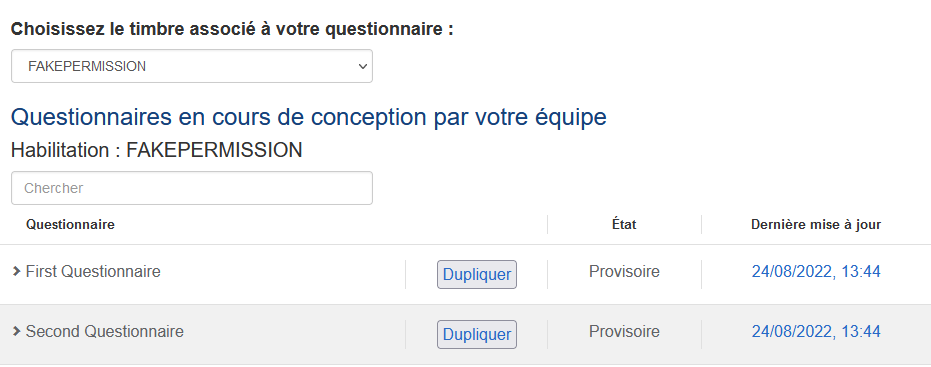
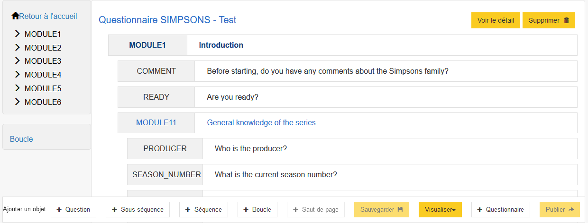

# Charger un questionnaire

Cette section illustre la manière dont l'information circule au sein de l'application. Pour cela, elle présente en détail ce qu'il se passe lorsqu'un utilisateur sélectionne un questionnaire.

Lorsqu'un utilisateur sélectionne un questionnaire au sein de la liste des questionnaires, le processus est composé de nombreuses étapes élémentaires, qui vont de l'envoi de la requête au service Web dédié à l'actualisation de l'interface. Globalement:

1. L'application affiche le composant `QuestionnaireList`.
2. L'utilisateur sélectionne un questionnaire dans la liste.
3. Le [créateur d'actions](https://github.com/InseeFr/Pogues/blob/cc5ee57a6dabaeaa3a752ec48e632b3f7e04801d/src/js/components/questionnaire-list.js#L34) `switchQuestionnaire` est appelé.
4. L'[action](https://github.com/InseeFr/Pogues/blob/cc5ee57a6dabaeaa3a752ec48e632b3f7e04801d/src/js/actions/app-state.js#L7) `SWITCH_TO_QUESTIONNAIRE` est envoyée. Elle contient l'identifiant du questionnaire.
5. La fonction [switchToQuestionnaire](https://github.com/InseeFr/Pogues/blob/cc5ee57a6dabaeaa3a752ec48e632b3f7e04801d/src/js/reducers/app-state/index.js#L111) du reducer `appState` met à jour la propriété `view` avec la valeur `QUESTIONNAIRE`.
6. L'application est ré-affichée.
7. Lorsque React affiche le composant  `PoguesApp`, la propriété `view` est valorisée, et le composant `QuestionnaireContainer` est [affiché](https://github.com/InseeFr/Pogues/blob/cc5ee57a6dabaeaa3a752ec48e632b3f7e04801d/src/js/components/pogues-app.js#L27-L30), à la place du composant `QuestionnairePicker`.
8. La méthode [componentWillMount](https://github.com/InseeFr/Pogues/blob/cc5ee57a6dabaeaa3a752ec48e632b3f7e04801d/src/js/components/pogues-app.js#L27-L30) du `QuestionnaireContainer` appelle le créateur d'actions [loadQuestionnaireIfNeeded](https://github.com/InseeFr/Pogues/blob/5df2bc748fc947b1e92d5ec637dc32ec437b11c9/src/js/actions/questionnaire.js#L94). Celui-ci prend l'identifiant du questionnaire en paramètre.
9. En imaginant que le questionnaire n'a pas été préalablement chargé, le créateur d'actions `loadQuestionnaire` est [appelé](https://github.com/InseeFr/Pogues/blob/cc5ee57a6dabaeaa3a752ec48e632b3f7e04801d/src/js/actions/questionnaire.js#L98).
10. Le composant affiche une [icône d'attente](https://github.com/InseeFr/Pogues/blob/465665aaf56e835f7b5ae13dff899531d44ed4bd/src/js/components/questionnaire-container.js#L48) pour indiquer que le questionnaire est en cours de chargement.
11. L'action `LOAD_QUESTIONNAIRE` est [envoyée](https://github.com/InseeFr/Pogues/blob/cc5ee57a6dabaeaa3a752ec48e632b3f7e04801d/src/js/actions/questionnaire.js#L103), elle contient l'identifiant du questionnaire.
12. La fonction [getQuestionnaire](https://github.com/InseeFr/Pogues/blob/cc5ee57a6dabaeaa3a752ec48e632b3f7e04801d/src/js/utils/remote-api.js#L118) est appelée. Le navigateur lance la requête et retourne une Promesse.
13. La requête est réussie et la Promesse renvoie une représentation en `JSON` du questionnaire.
13. [La suite de la promesse]((https://github.com/InseeFr/Pogues/blob/cc5ee57a6dabaeaa3a752ec48e632b3f7e04801d/src/js/actions/questionnaire.js#L101) définie par le créateur d'actions est exécutée.
14. Elle appelle la fonction [toSate](https://github.com/InseeFr/Pogues/blob/cc5ee57a6dabaeaa3a752ec48e632b3f7e04801d/src/js/utils/model-to-state-questionnaire.js#L17) et envoie l'action `LOAD_QUESTIONNAIRE_SUCCESS` accompagnée du résultat retourné par cette fonction.
15. L'action `LOAD_QUESTIONNAIRE_SUCCESS` est traitée par de nombreux reducers pour mettre à jour l'état de l'application: ajouter une entrée à l'état géré par le reducer `questionnaires-by-id`, ajouter plusieurs entrées à l'objet `components-by-id` (une pour chaque séquence et pour chaque question du questionnaire), ajouter plusieurs entrées à `code-by-id` (une pour chaque code de chaque liste de codes utilisée dans le questionnaire)...
16. L'interface est actualisée. Le contenu du questionnaire est désormais visible.

